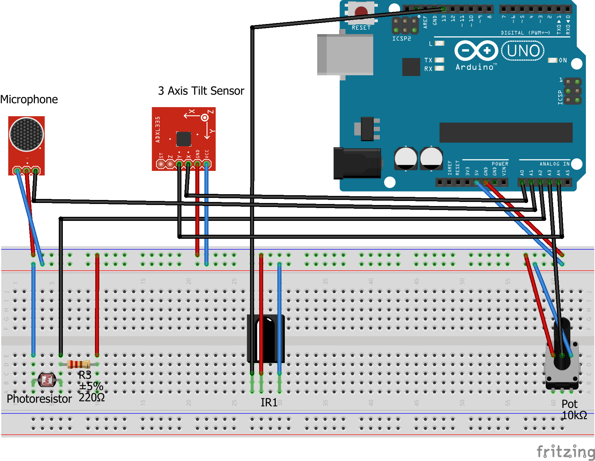

<h1>ByteSense</h1>

<h2>About</h2>
ByteSense is a project we (<a href="https://github.com/KwesiD">Kwesi Daniel</a> and <a href="https://github.com/deniskaydanov">Denis Kaydanov</a>) developed for our Expressive Cultures: Sounds class at New York University.

ByteSense is an Arduino-Uno-based musical instrument that generate MIDI notes based on sensor inputs.
The current sensors are:
1. IR Sensor
2. Sound Sensor
3. Photoresistor
4. Gyrosensor

The tempo is controlled by MIDI events determined by a potentiometer. 

ByteSense can work with any Digital Audio Workstation (DAW), but for the sake of the project, we worked with Abelton Live 9. 

<h2>Timing</h2>
Our implementation receives MIDI clock events from Ableton. <a href="https://en.wikipedia.org/wiki/MIDI_beat_clock"> Clock events are sent by Abelton at a rate of 24 pules per quarter note.</a> Each sensor sends its own note on a particular pulse number (ie: every 12th pulse for 8th notes).

<h2>Notes</h2>
Analog voltage values from the sensors are arbitrarily scaled and converted into MIDI notes.

<h2>Schematic</h2>

